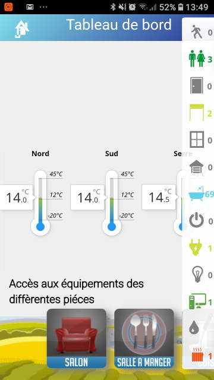
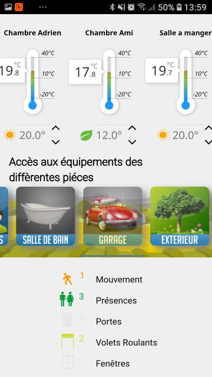
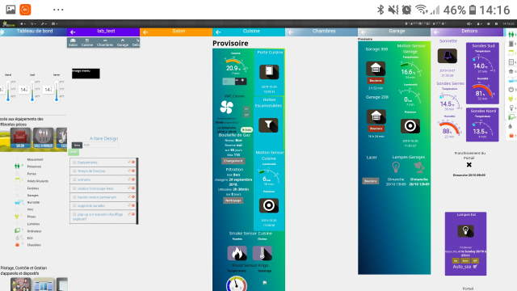
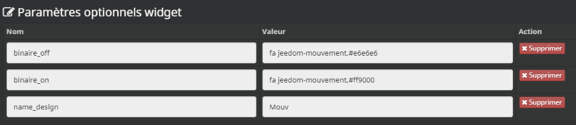

DESIGN POUR JEEDOM V3
Actualisation :

02/11/2019 : barre de menu :
- disparaît en fondu lorsqu'on clic sur un élément la composant ;
- apparition / disparition avec un swipe droite / gauche .

24/10/2019 : menu image : ajout scroll souris PC

 Visu Portable

Visu Bureau

Taille du Design
* LxH = 7200 x 3400

Taille du menu flottant
* poxition X : 0
* position Y : 0
* largeur px : 7200
* Hauteur px : 45

Taille du menu image
* poxition X : 0
* position Y : 14.127906976744
* largeur px : 360
* Hauteur px : 125

widget (numérique) icon résumé
* binaire_off (icon et couleur), 
* binaire_on (icon et couleur), 
* name_design (pour report menu flottant) avec pour préfix state et iconCmd

